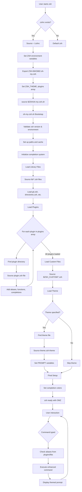

# How Oh My Zsh Works: Logic Flow and Architecture

## High-Level Overview

Oh My Zsh is a **shell enhancement framework** that sits between the user and zsh, providing a rich ecosystem of themes, plugins, and utilities. It works by:

1. **Intercepting the zsh initialization process**
2. **Loading its own configuration system**
3. **Enhancing zsh with plugins, themes, and utilities**
4. **Providing a management CLI**

## Logic Flow Chart



## Detailed Interface Mechanism

### 1. **Initialization Hook (.zshrc)**
```bash
# User's ~/.zshrc contains:
export ZSH="$HOME/.oh-my-zsh"
ZSH_THEME="robbyrussell"
plugins=(git node npm)
source $ZSH/oh-my-zsh.sh  # This is the key hook
```

### 2. **Bootstrap Process (oh-my-zsh.sh)**
The main script performs these steps:

**Environment Validation:**
- Checks if running in zsh (not bash/sh)
- Validates zsh version compatibility
- Sets up core variables ($ZSH, $ZSH_CUSTOM, $ZSH_CACHE_DIR)

**Function Path Setup:**
```bash
fpath=($ZSH/{functions,completions} $ZSH_CUSTOM/{functions,completions} $fpath)
```

**Completion System:**
- Initializes zsh's completion system (`compinit`)
- Creates completion cache files
- Sets up security checks for completion files

### 3. **Loading Sequence**

**Library Loading:**
```bash
for lib_file ("$ZSH"/lib/*.zsh); do
  _omz_source "lib/${lib_file:t}"
done
```
Loads core functionality like git helpers, directory navigation, history management.

**Plugin Loading:**
```bash
for plugin ($plugins); do
  _omz_source "plugins/$plugin/$plugin.plugin.zsh"
done
```
Each plugin adds its own aliases, functions, and completions to the shell.

**Theme Loading:**
```bash
if [[ -n "$ZSH_THEME" ]]; then
  source "$ZSH/themes/$ZSH_THEME.zsh-theme"
fi
```
Themes modify the `$PROMPT` and `$RPROMPT` variables to customize appearance.

### 4. **Runtime Integration**

**Alias System:**
Oh My Zsh doesn't replace zsh commands - it adds **aliases** and **functions** that wrap or enhance them:
```bash
# From git plugin:
alias gst='git status'
alias gco='git checkout'
alias gaa='git add --all'
```

**Prompt Integration:**
Themes integrate with zsh's prompt system by setting variables:
```bash
# robbyrussell theme:
PROMPT='%(?:%{$fg_bold[green]%}➜ :%{$fg_bold[red]%}➜ ) %{$fg[cyan]%}%c%{$reset_color%} $(git_prompt_info)'
```

**Hook System:**
Uses zsh's hook mechanisms:
- `precmd_functions`: Run before each prompt
- `preexec_functions`: Run before each command
- `chpwd_functions`: Run when directory changes

### 5. **Key Integration Points**

**Completion Enhancement:**
- Extends zsh's tab completion with plugin-specific completions
- Adds colors and formatting to completion menus

**History Management:**
- Enhances history search and navigation
- Adds history-related aliases and functions

**Directory Navigation:**
- Adds directory stack management
- Provides shortcuts like `..`, `...`, `....`

**Git Integration:**
- Real-time git status in prompt
- Extensive git aliases
- Git-aware directory navigation

## Architecture Summary

Oh My Zsh works as a **configuration layer** on top of zsh:

1. **Non-intrusive**: Doesn't modify zsh itself, only configuration
2. **Modular**: Plugins and themes are independent components  
3. **Extensible**: Users can add custom plugins/themes
4. **Override-friendly**: Custom configurations take precedence
5. **Performance-aware**: Lazy loading and caching where possible

The framework essentially transforms a basic zsh shell into a feature-rich development environment through systematic enhancement of aliases, functions, completions, and visual appearance, all while maintaining full zsh compatibility.